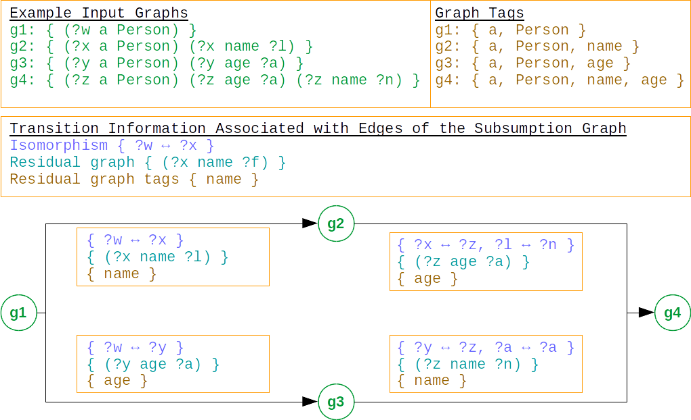

# Subgraph Isomorphism Index

***Documentation is in the works***

A generic Index Data Structure for Fast Isomorphic Subset and Superset Queries implemented in Java.

This project features generic Map-like index structure for isomorphic sub graphs (and sub sets):
The index maintains (Key, Graph) pairs and supports querying for all keys, whose correspondings graphs are isomorphic to a given query graph.
The index implementation itself is agnostic of key and graph types and is designed for easy adaption to custom graph types.


```xml
<!-- Replace ${module} with 'core', 'jgrapht' or 'jena' (without quotes) -->
<dependency>
    <groupId>org.aksw.commons</groupId>
    <artifactId>subgraph-isomorphism-index-${module}</artifactId>
    <version>1.0.0-SNAPSHOT</version>
</dependency>
```

* _core_: is the base implementation and is indepentent of any specific set or graph type
* _jgrapht_: provides utils to parameterize the core implementation with JGraphT features; depends on _core_
* _jena_: provides jena bindings; dependends on _jgrapht_


```java
// The graph-based core index
SubgraphIsomorphismIndex<String, Graph, Node> baseIndex = SubgraphIsomorphismIndexJena.create(), PseudoGraphJenaGraph::new);

// A function for mapping custom objects to a graph type supported by the index.
// In this case, a custom functon for parsing strings to graphs
Function<String, Graph> graphParser = ...;

// Index wrapper where we can conveniently put in strings
SubgraphIsomorphismIndex<String, String, Node> index = SubgraphIsomorphismIndexWrapper.wrap(baseIndex, parseStringToGraph);

index.put("g1", "{ ?w a :Person }");
index.put("g2", "{ ?x a :Person ; :name ?l }");
index.put("g3", "{ ?y a :Person ; :age ?a }");
index.put("g4", "{ ?z a :Person ; :age ?a ; :name ?n }");

Multimap<String, BiMap<Node, Node>> keyToIsos = index.lookup("{?foo a :Person ; :name ?bar }");

// Expected
g1: ?w -> ?foo
g2: ?x -> ?foo, ?l -> ?bar
```


## How it works


At the core, the index builds a directed rooted acyclic multi graph which captures all subsumption relations among the inserted graphs:
* The graph is
  * _directed_ as subsumption is an asymmetric relation
  * _rooted_ as there is a root node which conceptually corresponds to the empty graph which is subsumed by every other graph.
  * _acyclic_ as if two entries e1 and e2 had graphs that were isomorphic, then the one inserted first (let's assume e1) becomes the primary entry and gets represented as a node in the index graph. The index performs extra book keeping for marking e2 a secondary entry of e1.
  * _multi graph_ as multiple isomorphisms may exists between two graphs.


The index is based on a hybrid approach combining the following components:
  * standard set operations (intersection, difference, union) + a function that yields a new set from a given one by applying an (isomorphism) mapping
  * sub graph isomorphism algorithm for graphs (such as VF2)
  * set containment checker for tags (such as Set Trie)



* Each vertex corresponds to an entry, i.e. a (key, graph) pair.
* An edge between e1 and e2 indicates the existence of a subgraph isomorphism from e1 to e2. The edge further holds information about "how" e2 can be reached from e1, concretely:
  * _Subgraph isomorphism_ from e1.graph to e2.graph, for example "e1 becomes a subgraph of e2 if all ?x were replaced with ?y"
  * _Residual graph_: This is e2's graph without that of e1 after having applyed the isomorphism, i.e. `Sets.difference(e2.graph, applyIso(e1.graph, edge.iso))
  * _Residual Tags_: Tags describe _static_ (unaffected by isomorphisms) features of graphs, such as node / edge labels which must not be remapped.


Let's say we had 10000 graphs with no subsumption, then all these graphs would be children of the root node, and the index would have linear complexityHowever, by indexing the edges by their residual tags we may be able to do significantly better:
In order for an edge to qualify as a candidate for thorough isomoprhism checks with a (residual) query graph, the
residual tags of an edge must be a _subset_ of the tags of the residual query graph.
This means, that we can efficiently prune testing of edges having features_not_ present in the query graph.


TODO Note: The residual graph tags can be fewer than the set of tags derived from the residual graph: This happens when a tag was already encountered at a transitively subsumed graph.


### Querying / Lookup
Given a query graph q, then the lookup procedure recursively, starting from the root, searches the index graph for all entries for which a sub graph isomorphism exists to the query graph.

 


### Insertion
TODO

### Querying / Lookup
TODO

### Deletion
TODO


The index is based on a hybrid approach combining a sub graph isomorphism algorithm (such as VF2) and 
